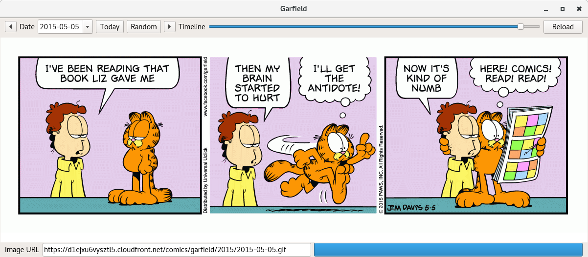

# Garfield

*Garfield je tlustý a lenivý zrzavý kocour, který je závislý na kávě, miluje lasagne a nesnáší pondělky*

Garfield je jednoduchý prohlížeč stejnojmenného komixu napsaný za pomoci Qt frameworku. Jen tak pro zábavu. Během jedné noci, kdy jsem nemohl spát.

## Momentka

## Copyleft

"THE BEER-WARE LICENSE" (Revision 42):
<janak@astronomie.cz> wrote this file. As long as you retain this notice
you can do whatever you want with this stuff. If we meet some day, and you
think this stuff is worth it, you can buy me a beer in return Zdeněk Janák

